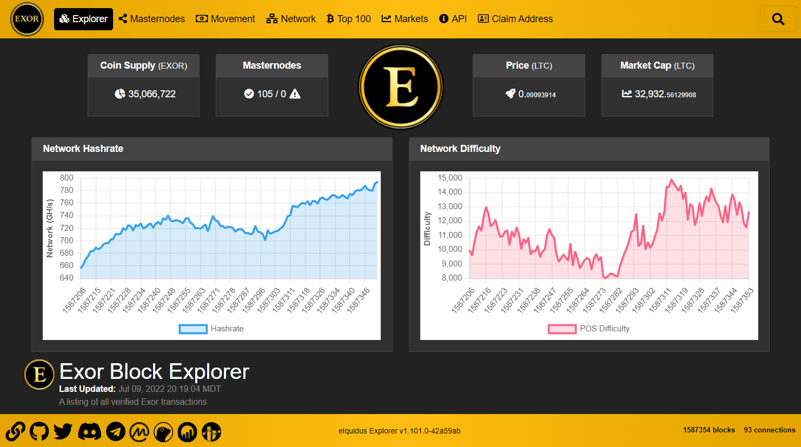

# Explorador Eiquidus 2023

  

La guía es tomada de https://github.com/team-exor/eiquidus, aunque primero instalaremos algunas herramientas.

También se tomaron como base las siguientes guías ::

* <a href="https://gist.github.com/scottie/b6179c34ce3cf200fcc5d08727a46623">Node and Iquidus Explorer Setup for Dummies</a>
* <a href="https://gist.github.com/samqju/b9fc6c007f083e6429387051e24da1c3">Beginners Guide for Iquidus Explorer Setup</a>

## Herramientas

* <a href="https://webmin.com/">Webmin</a>
* <a href="https://github.com/nvm-sh/nvm">NVM, Node Versión Manager</a>
* <a href="https://docs.mongodb.org/manual/tutorial/install-mongodb-on-ubuntu/
">Base de datos MongoDb</a>
